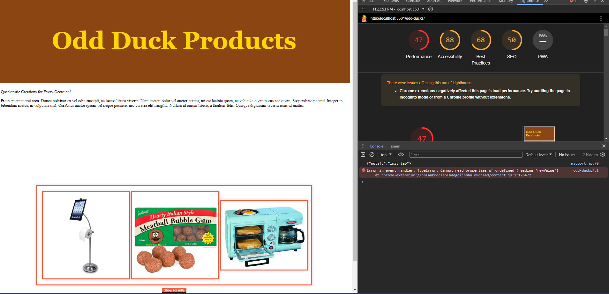
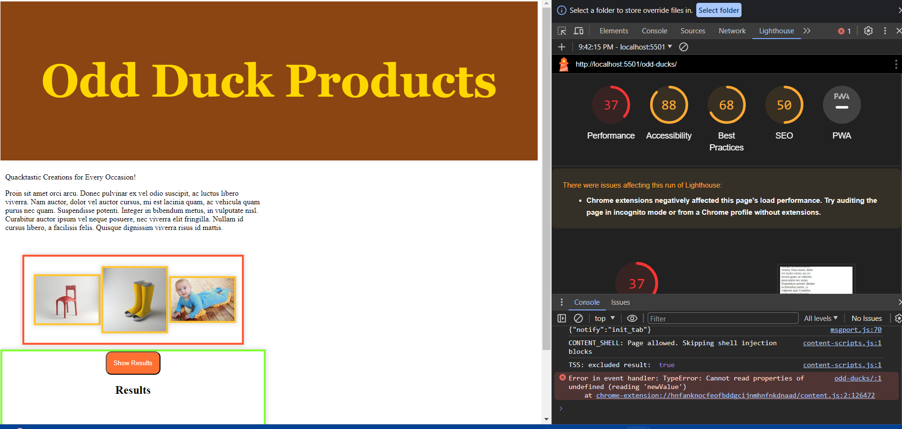
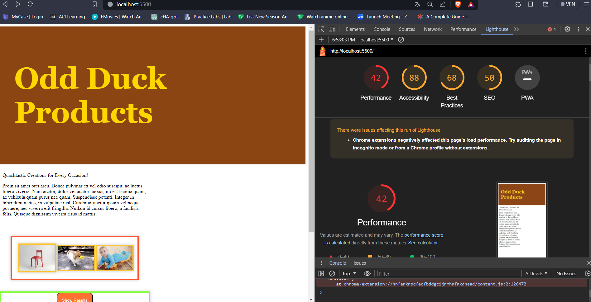

# ODD DUCK PRODUCTS

## Lab: Odd Duck Products

### Problem Domain

Odd Duck Product Co is trying to decide which project from their R&D department they should invest in next to sell. They asked you to make a web page that they can run at a kiosk at the front entrance of their campus. Whenever an employee walks by, the employee can vote for 1 of the 3 products displayed that they think should be the next new product brought to market. After a week of collecting data, they would like some nice graphs to visualize the results.

To make this data collection project maximally effective, Odd Duck wants you to build an app that displays three potential products side-by-side-by-side, without favoring any single product. You’ll need to manage the size and the aspect ratio of the images.

As the app’s purpose is to have the staff members choose which product, of the three displayed images, that they would be most interested in seeing as a new creation, you will need to store each anonymous vote, calculate totals, and visually display the results.

To keep the product selection process as untainted as possible, you have been instructed to not allow any results to be shown to users until there have been a total of 25 selections made.

The marketing team is not only interested in the total number of clicks, but also the percentage of times that an item was clicked when it was shown. So, you’ll also need to keep track of how many times each image is displayed and do the calculations.

You are also responsible for the look and feel of the app, so don’t forget a custom font, color palette, layout with semantic HTML, and so on.

### Instructions

1. As a user, I would like to display three unique products by chance so that the viewers can pick a favorite.

   - Create a constructor function that creates an object associated with each product and has the following properties:
     - Name of the product
     - File path of image
     - Times the image has been shown

   - Create an algorithm that will randomly generate three unique product images from the images directory and display them side-by-side-by-side in the browser window.

   - For each of the three images, increment its property of times it has been shown by one.

   - Attach an event listener to the section of the HTML page where the images are going to be displayed.

   - Once the user 'clicks' a product, generate three new products for the user to pick from.

2. As a user, I would like to track the selections made by viewers so that I can determine which products to begin production on.

   - In the constructor function, define a property to hold the number of times a product has been clicked.

   - After every selection by the viewer, update the newly added property to reflect if it was clicked.

3. As a user, I would like to control the number of rounds a user is presented with so that I can control the voting session duration.

   - By default, the user should be presented with 25 rounds of voting before ending the session.
   - Keep the number of rounds in a variable to allow the number to be easily changed for debugging and testing purposes.

4. As a user, I would like to view a report of results after all rounds of voting have concluded so that I can evaluate which products were the most popular.

   - Create a property attached to the constructor function itself that keeps track of all the products that are currently being considered.

   - After voting rounds have been completed, remove the event listeners on the product.

   - Add a button with the text View Results, which, when clicked, displays the list of all the products followed by the votes received and the number of times seen for each. Example: banana had 3 votes and was seen 5 times.

   NOTE: Displayed product names should match the file name for the product. Example: the product represented with dog-duck.jpg should be displayed to the user as exactly "dog-duck" when the results are shown.

5. Using Lighthouse in the Chrome DevTools, analyze the accessibility of your application.

   - In this module, try for a score higher than 80. Make necessary adjustments based on the report to achieve that score.
   - Add a screenshot of your score to your README.md file.

#### Stretch Goals

- Handle the display and voting for an arbitrary number of images
- Using a variable, declare in your JS how many images to show.
- Based on that value, dynamically create that many `` tags.
- Also based on that value, ensure that your randomizer is properly handling the specified number of images for display and repeat tracking.

### Resources

The assets for this lab can be found in your class11/lab/assets folder of your daily class repo.

Provided in your class repo is a suggested wireframe to follow while building out your Odd Duck Products application.

#### Developer Style Guide

- Create a new repo for this multi-lab project called odd-duck.
- Scaffold your repo with the usual README, CSS, JS, and HTML files, plus an img/ directory.
- Include in your repository a .eslintrc.json file whose contents are copied from the eslintrc.json file in the class repository.
- Retrieve the assets from the assets/ directory and place them in your image directory.
- Do today’s work on a branch called lab11.

This is an individual assignment today, but you are free to collaborate with classmates if you want. Just be sure that if you do, make a note of that collaboration in your README file.

11/06/2023: 

 -**Lab 12**-

-**Instructions**-

Below are your lab requirements in a user story format. Try and think up what the feature tasks would be for each story, once you are done, or you get stuck, review the provided feature tasks to see what the actual tasks are for each story.

1. As a marketeer, I want to prevent users from seeing the same image in two subsequent iterations, so that they are not biased.

- Update your algorithm to randomly generate three unique product images from the images directory.
- Update your algorithm so that new products are generated, confirm that these products are not duplicates from the immediate previous set.

2. As a marketing manager, I would like a visual representation of how many times a product was clicked so that I can visually analyze the results.

- Using ChartJS (imported from CDN), display the vote totals and the number of times a product was viewed in a bar chart format. (hint: don’t forget about the <canvas> tags)
- Place the bar chart in the section located beneath your three product images
- The bar charts should only appear after all voting data has been collected.

3. Run a Lighthouse Accessbility report. Make necessary updates to your application based on the report to get your score above 80.

Add a screenshot of your score to your README.md file.
Stretch Goals
Try some additional charting types based off of some of the other data you collected and display them in addition to the required bar chart

11/07/2023

-**Lab 13**-

Instructions
Below are your lab requirements in a user story format. Try and think up what the feature tasks would be for each story, once you are done, or you get stuck, review the provided feature tasks to see what the actual tasks are for each story.

As a user, I would like my data to persistently track totals between page refreshes, so that I can keep track of the aggregate number of votes.

Implement local storage into your current application
Make sure the data persists across both browser refreshes and resets
Hints:

Store the products array into local storage as a formatted JSON string
Retrieve the products array from local storage and then utilize the JSON.Parse() function. Remember, if your constructor utilizes prototype methods, you will have to send each item in the array back through the constructor function.

Run a Lighthouse Accessbility report. Make necessary updates to your application based on the report to get your score above 80.

Add a screenshot of your score to your README.md file.

